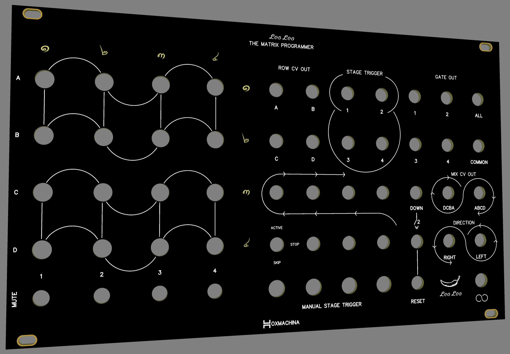

# Leo Leo - The Matrix Programmer

Features:

"Leo Leo" (faster in thai) is a programmer/sequencer module based on the first original Serge Programmer from the 70s, after discussing with Elby Designs and Serge himself who gave me open direction for this project, alongside some recommendations, I am happy to share here my evolution of the Programmer as an open source DIY project, this is quite the module and requires proper context, demonstration and education, below are a list of videos I've made myself to cover all the different aspects of this module.

To make it simpler for now, think of it as a, 4x4, 2x8, 2x16 analog Step Sequencer with individual CV outs per stage/step plus special sequential outs as well as a "ABCD" and "DCBA" outputs.

There's no notion of clock, so there's no internal clocking, you have inputs to make the programmer active from left to right, right to left and/or top to bottom and on each direction you take you can define rules per stage/step on what should happen (skip, mute, stop, play).

This is module to explore for sure, if I have you interest still, then please feel free to browse around my list of videos below about this special module.

Demos: Coming soon!

## Build Instructions
* You can easiliy order all needed components from [Tayda](https://www.taydaelectronics.com) online shop simply by uploading the ["Tayda Auto Order"](./Tayda%20Auto%20Order.csv) CSV file at https://www.taydaelectronics.com/quick-order/
* Print out the BOM file
* Please keep in mind that also the frontpanel should be produced in FR4 material when ordering it and not in aluminium (Just use the same material to build the PCBs and Front Panel) since the lightning effect only works with the FR4 material
* Follow the build instructions documentation PDF

## Panel Skeleton Overview

## Specs

TBD

## Disclaimer
All electronic projects and designs shared on this repository, or associated web sites should considered dangerous if not lethal if not used safely. When working on projects based on these designs, use extreme care to ensure that you do not come into contact with mains AC voltages or high voltage DC. If you are not confident about working with mains voltages, or high voltages, or you are not legally allowed to work with mains voltages, or high voltages, you are advised not to attempt work on them. The author, host, and all contributors associated with these repositories disclaim any liability for damages should anyone be killed or injured while working on these projects, or projects based on these designs, or any other project or design presented on these repositories and any associated repositories. The author, host, and all contributors associated with these repositories also disclaim any liability for projects, or projects based on these designs, or any other project or design presented on these repositories and any associated repositories when used in such a way as to infringe relevant government regulations and by-laws. 
